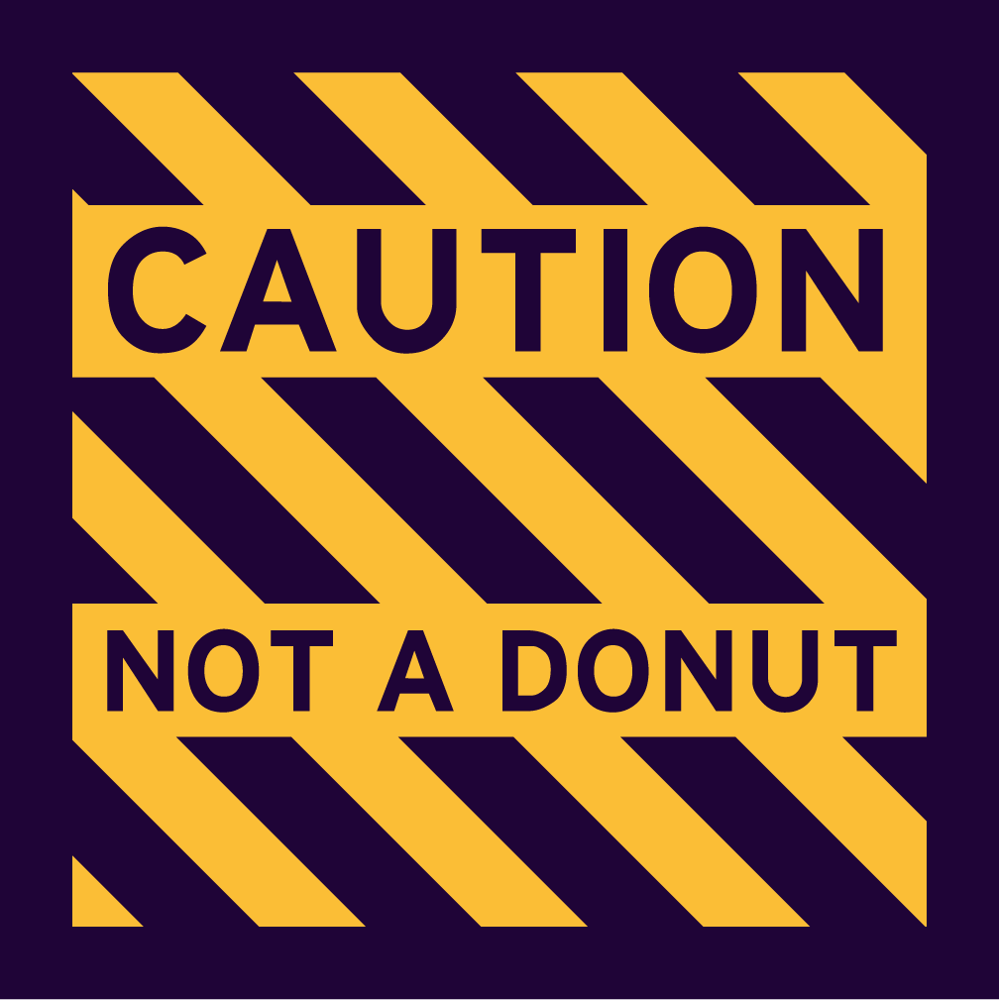
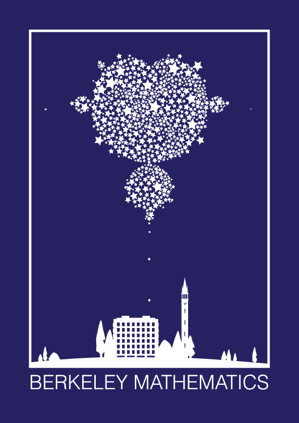
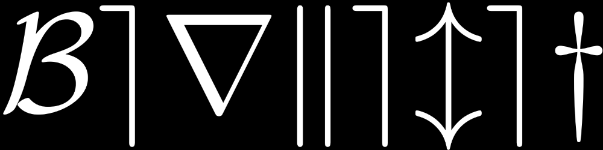

## How to Buy Gear

We sell T-shirts and mugs with Berkeley Math designs. To buy them during the semester, come find us at Friday tea. We also sell mugs, stickers, and shirts on [Redbubble](https://www.redbubble.com/people/MGSA/shop).

{}
## Mugs

Perfect reusable vessel for math fuel of several varieties -- just bring it to 1015 during tea and fill it up!

{}







{}

Price: $15
{}

## T-shirts

Proudly display your Berkeley Math-osity with an attractive Berkeley math shirt. Quite useful for wearing in places like seminars and restaurants, and great as gifts for your friends and family!

{}

{}







{}
{}



{{< figure caption="Design D: \mathcal{Berkeley} (front and back)">}}


{}
{}

Price: $15

{}
## Hoodies

We are also selling (limited) hoodies in designs C and D.

Price: $30
{} 